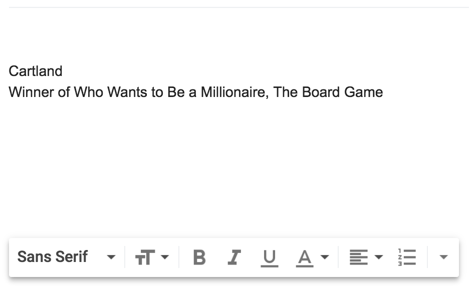

    Copyright 2018 Chris Cartland. All rights reserved.

    Licensed under the Apache License, Version 2.0 (the "License");
    you may not use this file except in compliance with the License.
    You may obtain a copy of the License at

        http://www.apache.org/licenses/LICENSE-2.0

    Unless required by applicable law or agreed to in writing, software
    distributed under the License is distributed on an "AS IS" BASIS,
    WITHOUT WARRANTIES OR CONDITIONS OF ANY KIND, either express or implied.
    See the License for the specific language governing permissions and
    limitations under the License.

# Gmail Signature Modifier

Modify Gmail signatures based on http://wescpy.blogspot.com/2016/12/modifying-email-signatures-with-gmail.html.

# Setup

* Install and activate Virtualenv https://virtualenv.pypa.io/en/stable/

      virtualenv env
      source env/bin/activate

* Install Python Dependencies

      pip install -r requirements.txt

# Google API Console

* https://console.developers.google.com/apis/credentials
* Create an OAuth 2.0 client ID of type "Other"
* Download as `client_secret.json`

# Configure

* Set name in `name.txt`
* Set quotes in `quotes.txt`

# Change Signature

    python change-signature.py

* Refresh Gmail, compose new message

# Delete Signature

    python delete-signature.py

* Refresh Gmail, compose new message

